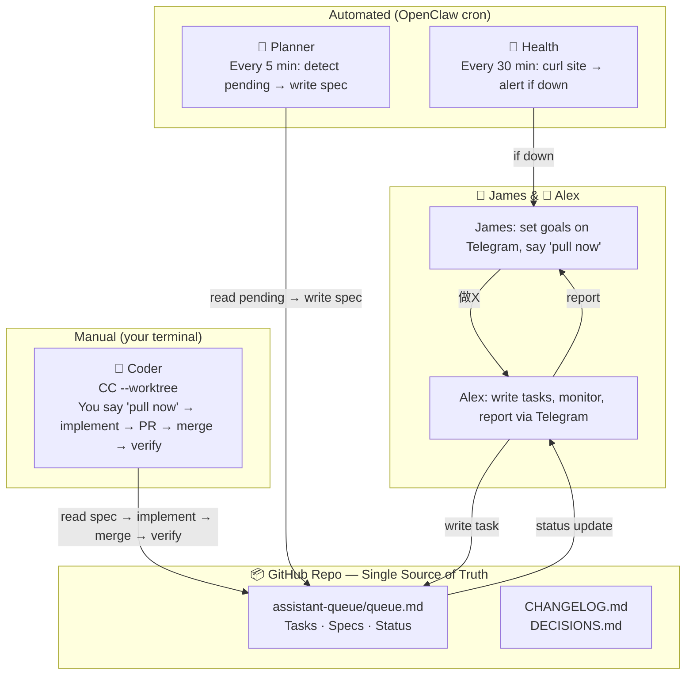
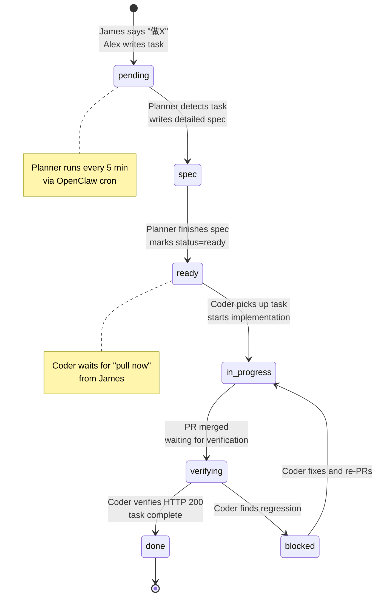
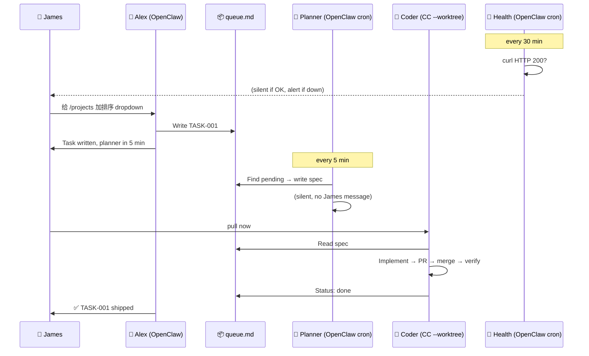

# Product Tracer — Autonomous Development System

> Version 2.0 — 2026-06-28
> Final architecture: 3 OpenClaw cron agents + 1 Claude Code Coder.

---

## Philosophy

- **Human in the loop, not in the way.** James sets goals on Telegram; agents execute. James can intervene at any time via Telegram or the Coder terminal.
- **Separation of concerns.** Planning, coding, and verification are handled by different agents. No single agent wears multiple hats.
- **State is in the repo.** `assistant-queue/queue.md` is the single source of truth for task state. Agents read from it, write to it, and push via git.
- **Worktree isolation.** The Coder agent runs in its own `git worktree`, so James can work on his own `main` branch simultaneously without conflicts.
- **Start simple.** One Coder agent. Add more only when there's clear evidence the bottleneck is Coder throughput (not planning, reviewing, or James's own time).

---

## Architecture Overview



---

## The Queue File — State Machine

All task state lives in `assistant-queue/queue.md`. Each task transitions through these states:



### Queue File Format

```markdown
# Product Tracer — Development Queue

Last updated: 2026-06-28 11:00 PDT

---

## [2026-06-28] TASK-001: Fuzzy search for /projects
- **Priority**: P1
- **Scope**: apps/web/
- **Status**: spec
- **Acceptance**: typing "reac" shows "React" results
- **Spec**:
  - Change: add `fuse.js` dep, implement client-side fuzzy search on project name + description
  - Files: apps/web/app/projects/projects-table.tsx, apps/web/package.json
  - Edge cases: empty query shows all, debounce 200ms, highlight match

---

## [2026-06-27] TASK-000: Dark mode toggle
- **Priority**: P0
- **Scope**: apps/web/
- **Status**: done
- **Acceptance**: toggle in header switches dark/light, persists
- **PR**: #81
- **Verify**: PASS — all pages 200, toggle works
```

---

## Agent Specifications

### 1. Alex (Orchestrator) — OpenClaw Agent `main` (me)

| Property | Value |
|----------|-------|
| Runtime | OpenClaw (this session) |
| Persistence | Always on (Telegram) |
| Workspace | `/Users/jameshuang/.openclaw/workspace/` |

**Responsibilities:**
- Listen to James on Telegram
- Translate "做X" → structured task in `assistant-queue/queue.md`
- Monitor task progress
- Report status to James (when significant: task done, system down, etc.)
- Manage cron jobs (enable/disable/reconfigure)
- Write the initial `queue.md` and keep it clean

**Actions James can take:**
```
James: "加一个 dark mode"
  → Alex writes TASK-XXX to queue.md
  → "已写 task, planner 5min 内写 spec"

James: "先别做了，停了"
  → Alex disables planner cron

James: "系统状态？"
  → Alex reports: all cron jobs running / Planner idle / Coder idle / Health OK

James: "重做 TASK-000，没做好"
  → Alex resets status to pending in queue.md

James: "恢复"
  → Alex re-enables planner cron
```

---

### 2. Planner — OpenClaw Cron Agent (me)

| Property | Value |
|----------|-------|
| Runtime | OpenClaw cron |
| Persistence | Stateless, runs every 5 minutes |
| Schedule | `*/5 * * * *` |
| CWD | `/Users/jameshuang/Desktop/ai_project/product-tracer` |

**What it does:**
Every 5 minutes, if I detect a task with `Status: pending` in `queue.md`, I:
1. Read the task description and analyze what code changes are needed
2. Write a detailed spec section (what files to change, edge cases, migration needed)
3. Change status from `pending` to `spec`
4. Commit and push the change

If no pending tasks → I do nothing and stay silent.

**No Claude Code needed.** I can read/write files and run git commands directly.

---

### 3. Coder — Claude Code `--worktree` (your terminal)

| Property | Value |
|----------|-------|
| Runtime | CC `--worktree coder --dangerously-skip-permissions --name "PT Coder"` |
| Persistence | Stays open until you close it |
| Trigger | Manual (you start it, you say "pull now") |
| CWD | Auto-created worktree in `.claude/worktrees/coder/` |
| Skills | `/skill agent-session /skill vercel-verify /skill frontend-design` |

**Start command:**
```bash
cd /Users/jameshuang/Desktop/ai_project/product-tracer
claude --worktree coder --dangerously-skip-permissions --name "PT Coder"
```

**Goal prompt (paste after session starts):**
```markdown
/goal You are the Product Tracer Coder Agent.

YOUR ONLY JOB:
1. Read assistant-queue/queue.md
2. Find the first task with Status: "ready" or "spec"
3. Read its spec section carefully
4. git pull --rebase origin main
5. git checkout -b feat/task-XXX
6. Implement the code per spec
7. pnpm typecheck
8. gh pr create --fill
9. Poll CI every 30s (max 5 min): gh pr view --json statusCheckRollup
10. If Vercel ✅ → gh pr merge --squash
11. curl -sI https://product-tracer.vercel.app/ → 200
12. curl /projects /trends /youtube-insights /bookmarks /login → all 200
13. If migrations exist: psql "$DATABASE_URL" -f packages/db/migrations/XXX.sql
14. Update CHANGELOG.md
15. Write summary to assistant-queue/RESPONSE.md
16. In queue.md: change Status to "done", add PR # and verify result
17. git add -A && git commit -m 'coder: TASK-XXX done' && git push
18. Stay idle. Say "pull now" when James can start the next task.

GOLDEN RULES:
- NEVER re-read queue during a task. Finish first.
- NEVER close the session.
- If stuck → write "Status: blocked" in queue.md with the problem and wait.
- If a page returns non-200 → do NOT merge. Investigate first.
- When idle → just sit there. Say "done, waiting for next task".
- Self-review before PR: check for null safety, stray console.log, TODO comments.
```

**Session life cycle:**
```
James starts session → Coder loads skills → reads queue → implements task
  → pnpm typecheck → gh pr create → poll Vercel → merge → curl verify
  → update queue → idle
  → James says "pull now" → Coder picks next task → ...
```

---

### 4. Health Checker — OpenClaw Cron (me)

| Property | Value |
|----------|-------|
| Runtime | OpenClaw cron |
| Persistence | Stateless, runs every 30 minutes |
| Schedule | `*/30 * * * *` |
| CWD | `/Users/jameshuang/Desktop/ai_project/product-tracer` |

**What it does:**
Every 30 minutes, I:
1. `curl -sI https://product-tracer.vercel.app/` — must be 200
2. `curl -s -o /dev/null -w '%{http_code}' https://product-tracer.vercel.app/projects`
3. `curl -s -o /dev/null -w '%{http_code}' https://product-tracer.vercel.app/trends`

If all 200 → silent.
If any non-200 → Telegram alert to James: "🚨 Product Tracer DOWN: /page returned $status"

**No Claude Code needed.** I can curl URLs and send Telegram messages directly.

---

## Complete Flow — Walkthrough



---

## Setup Instructions

### Step 1: Create queue file

```bash
cd /Users/jameshuang/Desktop/ai_project/product-tracer
mkdir -p assistant-queue
```

*(Alex writes the initial queue.md)*

### Step 2: Register Planner cron (every 5 min)

```bash
openclaw cron add \
  --name planner \
  --cron "*/5 * * * *" \
  --agent main \
  --message "Read assistant-queue/queue.md from product-tracer repo. If there is a task with Status: pending, analyze the task and write a detailed spec section. Change Status to spec. Commit and push. Stay silent otherwise." \
  --timeout-seconds 180 \
  --session isolated
```

### Step 3: Register Health cron (every 30 min)

```bash
openclaw cron add \
  --name health \
  --cron "*/30 * * * *" \
  --agent main \
  --message "HTTP health check for product-tracer.vercel.app. curl /, /projects, /trends. If any non-200, send Telegram alert to James." \
  --timeout-seconds 60 \
  --session isolated
```

### Step 4: Start Coder session

```bash
cd /Users/jameshuang/Desktop/ai_project/product-tracer
claude --worktree coder --dangerously-skip-permissions --name "PT Coder"

# Paste this goal after session starts:
/goal [paste the Coder goal prompt from section 3 above]
```

### Step 5: Load skills (in Coder session)

```
/skill agent-session
/skill vercel-verify
/skill frontend-design
```

### Verification

```bash
openclaw cron list
# Should show: planner (every 5 min), health (every 30 min)
curl -sI https://product-tracer.vercel.app/  # → 200
ls .claude/worktrees/  # → shows coder/
```

---

## Daily Operation

| What you want | What you do |
|---------------|-------------|
| **Add work** | Telegram: "帮我在 /projects 加排序" → Alex writes task → Planner specs → you say "pull now" |
| **Check status** | Telegram: "系统状态？" |
| **Pause** | Telegram: "停了" |
| **Resume** | Telegram: "恢复" |
| **Force redo** | Telegram: "重做 TASK-001" → Alex resets to pending |
| **Leave for the day** | Coder idle. Cron keep running. Sitel stays monitored. |

---

## Rollback

```bash
openclaw cron disable <planner-id>
openclaw cron disable <health-id>
# In Coder terminal: Ctrl+C or type "exit"
git worktree remove .claude/worktrees/coder
```
