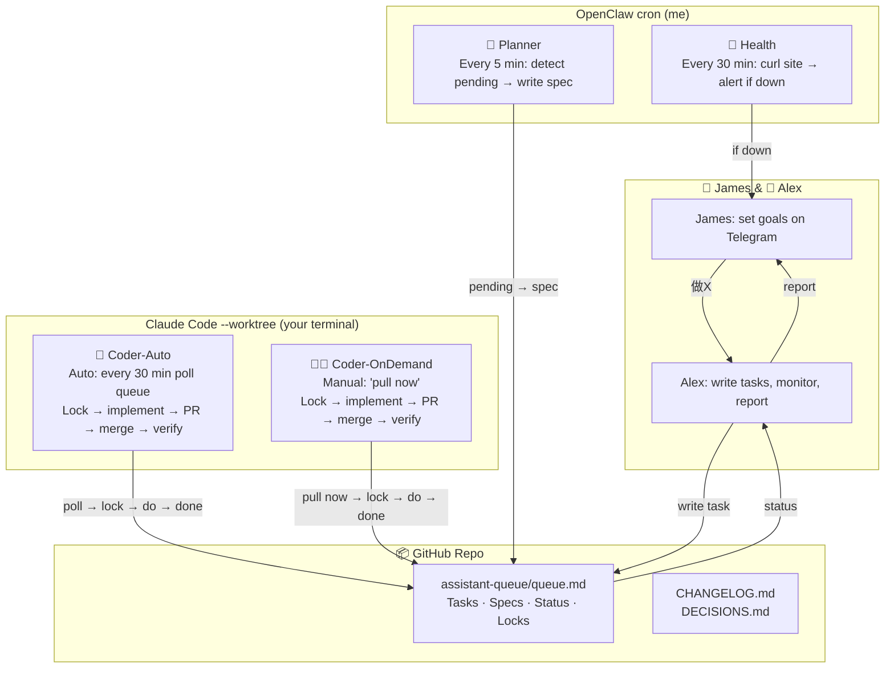
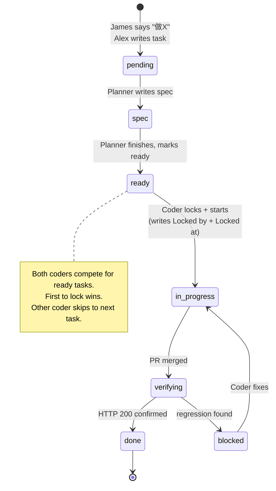
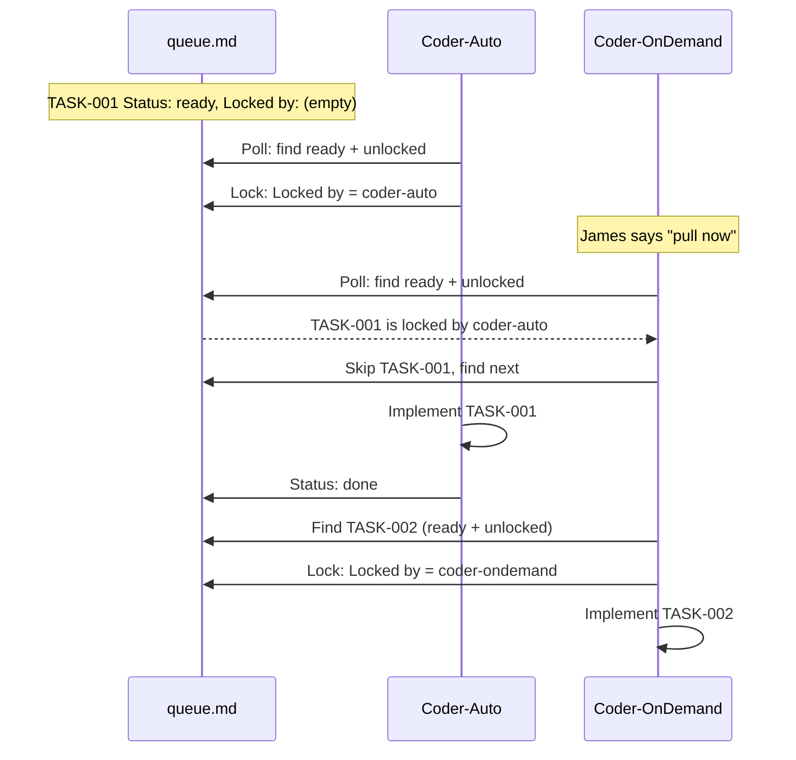

# Product Tracer — Autonomous Development System

> Version 3.0 — 2026-06-28
> Final architecture: 2 Coder agents + Planner + Health.

---

## Philosophy

- **Human in the loop, not in the way.** James sets goals on Telegram; agents execute without waiting for manual triggers.
- **Two Coder agents.** One runs autonomously every 30 minutes. One waits for James's "pull now" command. They coordinate via a lock mechanism in queue.md — no manual scope assignment needed.
- **Separation of concerns.** Planning, coding, and monitoring are handled by different agents.
- **State is in the repo.** `assistant-queue/queue.md` is the single source of truth. Everything reads from it, writes to it, and pushes via git.
- **Worktree isolation.** Each Coder has its own `git worktree`. They never touch the same working directory.

---

## Architecture Overview



---

## The Queue File — State Machine



### Queue File Format

```markdown
# Product Tracer — Development Queue

---

## [2026-06-28] TASK-001: Fuzzy search for /projects
- **Priority**: P1
- **Status**: ready
- **Locked by**:          (empty = available, coder-auto / coder-ondemand = taken)
- **Locked at**:          (ISO timestamp)
- **Acceptance**: typing "reac" shows "React" results
- **Spec**: ...

## [2026-06-27] TASK-000: Dark mode toggle
- **Priority**: P0
- **Status**: done
- **PR**: #81
- **Verify**: PASS — all pages 200
```

---

## Agent Specifications

### 1. Alex (Orchestrator) — OpenClaw Agent `main`

**Runtime:** OpenClaw (this session), always on via Telegram.

**Responsibilities:**
- Listen to James, translate "做X" → structured task in queue.md
- Write initial queue.md, keep it clean
- Monitor task progress
- Report status to James (task done, site down, etc.)
- Manage cron jobs

---

### 2. Planner — OpenClaw Cron (me)

| Property | Value |
|----------|-------|
| Schedule | `*/5 * * * *` |
| CWD | `/Users/jameshuang/Desktop/ai_project/product-tracer` |

Every 5 minutes, I check queue.md. If any task has `Status: pending`, I:
1. Analyze the task description
2. Write a detailed spec (what files, edge cases, SQL needed)
3. Change status to `ready`
4. Commit and push

No Claude Code needed. I read/write files and run git directly.

---

### 3. Coder-Auto — Claude Code `--worktree` (Autonomous)

| Property | Value |
|----------|-------|
| Runtime | CC `--worktree coder-auto --dangerously-skip-permissions --name "PT Coder Auto"` |
| Behavior | Polls queue every 30 min, locks + implements autonomously |
| Skills | `/skill agent-session /skill vercel-verify /skill frontend-design` |

**Start command:**
```bash
cd /Users/jameshuang/Desktop/ai_project/product-tracer
claude --worktree coder-auto --dangerously-skip-permissions --name "PT Coder Auto"
```

**Goal prompt:**
```markdown
/goal You are Coder-Auto for Product Tracer. Your job is to poll the queue every 30 minutes and implement tasks automatically.

BEHAVIOR:
1. Every 30 minutes: read assistant-queue/queue.md
2. Find first task with Status: "ready" AND Locked by: (empty)
3. Lock it: change "Locked by" to "coder-auto", "Locked at" to current timestamp
4. git add -A && git commit -m "lock: TASK-XXX by coder-auto" && git push
5. git pull --rebase origin main
6. git checkout -b feat/task-XXX
7. Implement per spec
8. pnpm typecheck → gh pr create --fill
9. Poll Vercel (max 5 min)
10. If ✅ → gh pr merge --squash
11. curl verify all pages 200
12. If migrations: psql "$DATABASE_URL" -f packages/db/migrations/XXX.sql
13. Update CHANGELOG.md → write RESPONSE.md → Status: done
14. git push → wait 30 min → poll again

LOCKING RULES:
- If another coder already locked the task (Locked by is not empty): skip it, find the next one
- If no ready + unlocked task exists: stay idle, wait 30 min
- Never work on a task without locking it first
```

---

### 4. Coder-OnDemand — Claude Code `--worktree` (Manual Trigger)

| Property | Value |
|----------|-------|
| Runtime | CC `--worktree coder-ondemand --dangerously-skip-permissions --name "PT Coder OD"` |
| Behavior | Waits for "pull now", locks + implements |
| Skills | `/skill agent-session /skill vercel-verify /skill frontend-design` |

**Start command:**
```bash
cd /Users/jameshuang/Desktop/ai_project/product-tracer
claude --worktree coder-ondemand --dangerously-skip-permissions --name "PT Coder OD"
```

**Goal prompt:**
```markdown
/goal You are Coder-OnDemand for Product Tracer. You only work when James tells you "pull now".

BEHAVIOR:
1. On "pull now": read assistant-queue/queue.md
2. Find first task with Status: "ready" AND Locked by: (empty)
3. Lock it: change "Locked by" to "coder-ondemand", "Locked at" to current timestamp
4. git add -A && git commit -m "lock: TASK-XXX by coder-ondemand" && git push
5. git pull --rebase origin main
6. git checkout -b feat/task-XXX
7. Implement per spec
8. pnpm typecheck → gh pr create --fill
9. Poll Vercel (max 5 min)
10. If ✅ → gh pr merge --squash
11. curl verify all pages 200
12. If migrations: psql "$DATABASE_URL" -f packages/db/migrations/XXX.sql
13. Update CHANGELOG.md → write RESPONSE.md → Status: done
14. git push → idle. Wait for next "pull now".

LOCKING RULES:
- Always check Locked by before starting. If non-empty, skip that task.
- Never work on a task without locking it first.
- When idle: just sit there. Say "waiting for pull now".
```

---

### 5. Health Checker — OpenClaw Cron (me)

| Property | Value |
|----------|-------|
| Schedule | `*/30 * * * *` |
| CWD | `/Users/jameshuang/Desktop/ai_project/product-tracer` |

Every 30 minutes, I curl `/`, `/projects`, `/trends`. All 200 → silent. Any non-200 → Telegram alert to James.

---

## Race Condition Prevention



**Key safety behaviors:**
- Both coders ALWAYS check `Locked by` before starting
- Lock is committed and pushed BEFORE implementation begins
- If a coder crashes mid-task, the lock remains (manual recovery: clear the lock)
- git push is the synchronization barrier — whichever coder pushes the lock first wins

---

## Setup Instructions

### Step 1: Create queue file

```bash
cd /Users/jameshuang/Desktop/ai_project/product-tracer
mkdir -p assistant-queue
```

*(Alex writes the initial queue.md)*

### Step 2: Register Planner cron

```bash
openclaw cron add \
  --name planner \
  --cron "*/5 * * * *" \
  --agent main \
  --message "Read assistant-queue/queue.md from product-tracer repo. If any task has Status: pending, write a detailed spec section. Change Status to ready. Commit and push." \
  --timeout-seconds 180 \
  --session isolated
```

### Step 3: Register Health cron

```bash
openclaw cron add \
  --name health \
  --cron "*/30 * * * *" \
  --agent main \
  --message "HTTP health check for product-tracer.vercel.app. curl /, /projects, /trends. If any non-200, alert James via Telegram." \
  --timeout-seconds 60 \
  --session isolated
```

### Step 4: Start Coder-Auto (runs autonomously)

```bash
# Terminal 1
cd /Users/jameshuang/Desktop/ai_project/product-tracer
claude --worktree coder-auto --dangerously-skip-permissions --name "PT Coder Auto"

# Paste goal
/skill agent-session
/skill vercel-verify
/skill frontend-design
# Then paste the Coder-Auto goal
```

### Step 5: Start Coder-OnDemand (manual trigger)

```bash
# Terminal 2
cd /Users/jameshuang/Desktop/ai_project/product-tracer
claude --worktree coder-ondemand --dangerously-skip-permissions --name "PT Coder OD"

# Paste goal
/skill agent-session
/skill vercel-verify
/skill frontend-design
# Then paste the Coder-OnDemand goal
```

### Step 6: Verify

```bash
openclaw cron list
# → planner (every 5 min), health (every 30 min)
curl -sI https://product-tracer.vercel.app/  # → 200
ls .claude/worktrees/
# → coder-auto/  coder-ondemand/
```

---

## Your daily routine

| Situation | Action |
|-----------|--------|
| **Add a feature** | Telegram: "帮我加排序 dropdown" → I write task → Planner specs → Coder-Auto picks it up within 30 min |
| **Coder-Auto is busy, you want to jump in** | Say "pull now" in Coder-OnDemand terminal → it locks next available task |
| **Check status** | Telegram: "系统状态？" |
| **Pause everything** | Telegram: "停了" |
| **Clear a stuck lock** | Telegram: "TASK-001 的 lock 清了" → I clear the Locked by field |
| **Leave for the day** | Coder-Auto keeps running. Coder-OnDemand stays idle. Health monitors. |
| **Return** | Check queue.md for what got done while you were away |
