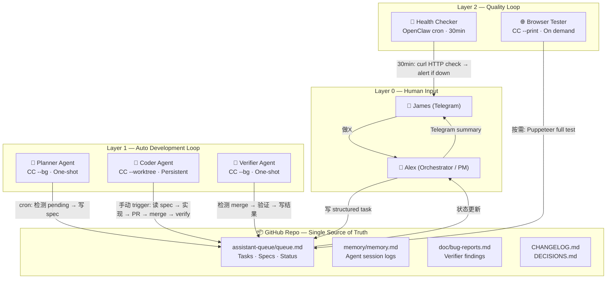
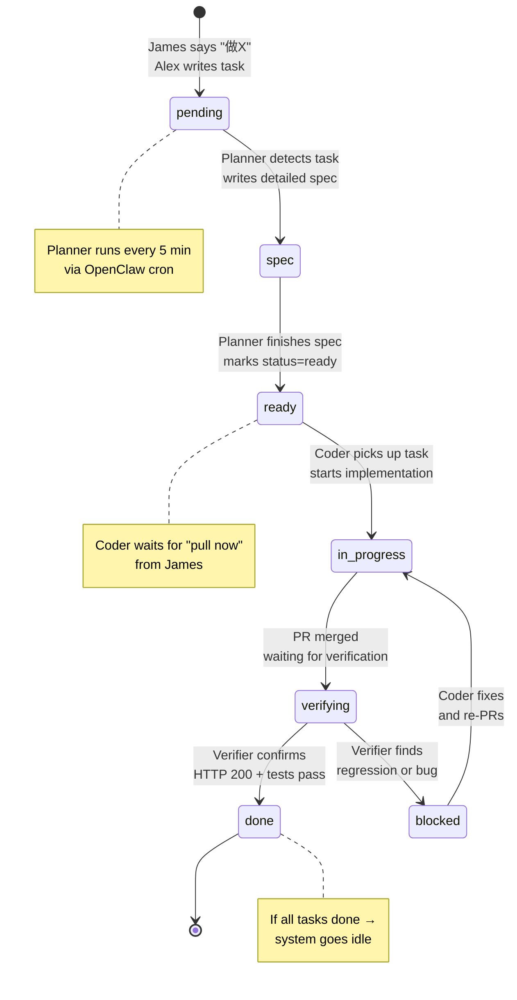
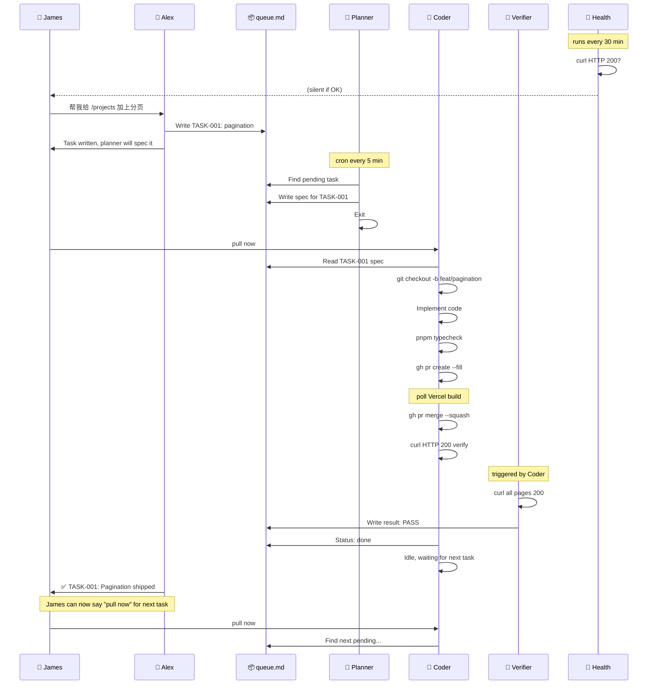

# Product Tracer — Autonomous Development System

> Version 1.0 — 2026-06-28
> Architecture for a multi-loop, multi-agent automated development pipeline.

---

## Philosophy

- **Human in the loop, not in the way.** James sets goals; agents execute. James can intervene at any time.
- **Separation of concerns.** Planning, coding, and verification are handled by different agents. No single agent wears multiple hats.
- **State is in the repo.** `assistant-queue/queue.md` is the single source of truth for task state. Agents read from it, write to it.
- **Worktree isolation.** Each coder agent has its own `git worktree`, so James can keep working on his own branch simultaneously.

---

## Architecture Overview



---

## The Queue File — State Machine

All task state lives in `assistant-queue/queue.md`. Each task transitions through these states:



### Queue File Format

```markdown
# Product Tracer — Development Queue

Last updated: 2026-06-28 11:00 PDT

---

## [2026-06-28] TASK-001: Fuzzy search for /projects
- **Priority**: P1
- **Scope**: apps/web/
- **Status**: spec
- **Acceptance**: typing "reac" shows "React" results
- **Spec**:
  - Change: add `fuse.js` dep, implement client-side fuzzy search on project name + description
  - Files: apps/web/app/projects/projects-table.tsx, apps/web/package.json
  - Edge cases: empty query shows all, debounce 200ms, highlight match

---

## [2026-06-27] TASK-000: Dark mode toggle
- **Priority**: P0
- **Scope**: apps/web/
- **Status**: done
- **Acceptance**: toggle in header switches dark/light, persists
- **PR**: #81
- **Verify**: PASS — all pages 200, toggle works
```

---

## Agent Specifications

### 1. Alex (Orchestrator) — OpenClaw Agent `main`

| Property | Value |
|----------|-------|
| Runtime | OpenClaw (this session) |
| Persistence | Always on (Telegram) |
| Skills | None needed (omnipotent) |
| Workspace | `/Users/jameshuang/.openclaw/workspace/` |

**Responsibilities:**
- Listen to James on Telegram
- Translate "做X" → structured task in queue.md
- Monitor task progress
- Report status to James when significant
- Maintain system config (cron, agents)

**Actions James can take:**
```
James: "加一个 dark mode"
  → Alex writes TASK-XXX to queue.md
  → "已写 task, planner 5min 内写 spec"

James: "先别做了，停了"
  → Alex disables planner cron

James: "为啥 TASK-001 卡住了？"
  → Alex checks queue status → reports

James: "重做 TASK-000，没做好"
  → Alex resets status to pending

James: "系统状态？"
  → Alex reports: all agents running / idle / blocked
```

---

### 2. Planner — Claude Code `--bg` (One-Shot)

| Property | Value |
|----------|-------|
| Runtime | CC `--bg --print "..." --dangerously-skip-permissions` |
| Persistence | One-shot, exits after write |
| Schedule | OpenClaw cron, every 5 minutes |
| Trigger | `cron/planner.yml` |
| CWD | `/Users/jameshuang/Desktop/ai_project/product-tracer` |
| Skills | None (just reads + writes files) |

**Command:**
```bash
claude --bg \
  --print "Read assistant-queue/queue.md. Find first task with Status: pending.
Analyze what code changes are needed based on the task description.
Write a spec section under that task.
Change Status to spec.
git add -A && git commit -m 'planner: spec for TASK-XXX' && git push" \
  --dangerously-skip-permissions
```

**Output (one-shot → exits):**
- If found pending → writes spec, commits, pushes
- If no pending → does nothing, exits silently

**OpenClaw cron definition (`cron/planner.yml`):**
```yaml
name: planner
schedule: "*/5 * * * *"
agent: main
task: |
  Check if assistant-queue/queue.md has a task with Status: pending.
  If yes → spawn `claude --bg --print "..."` advisor session.

  GOLDEN RULES:
  - Do NOT message James about this. It's routine.
  - If no pending tasks → do nothing.
```

---

### 3. Coder — Claude Code `--worktree` (Persistent Session)

| Property | Value |
|----------|-------|
| Runtime | CC `--worktree coder --dangerously-skip-permissions --name "PT Coder"` |
| Persistence | Stays open until killed |
| Trigger | Manual (James runs the command) |
| CWD | Auto-created worktree in `.claude/worktrees/coder/` |
| Skills | `/skill agent-session /skill vercel-verify /skill frontend-design` |

**Start command:**
```bash
cd /Users/jameshuang/Desktop/ai_project/product-tracer
claude --worktree coder --dangerously-skip-permissions --name "PT Coder"
```

**Goal prompt (paste after session starts):**
```markdown
/goal You are the Product Tracer Coder Agent.

YOUR ONLY JOB:
1. Read assistant-queue/queue.md
2. Find the first task with Status: "ready" or "spec"
3. Read its spec section carefully
4. git pull --rebase origin main
5. git checkout -b feat/task-XXX
6. Implement the code per spec
7. pnpm typecheck
8. gh pr create --fill
9. Poll CI every 30s (max 5 min): gh pr view --json statusCheckRollup
10. If Vercel ✅ → gh pr merge --squash
11. curl -sI https://product-tracer.vercel.app/ → 200
12. curl /projects /trends /youtube-insights /bookmarks /login → all 200
13. If migrations exist: psql "$DATABASE_URL" -f packages/db/migrations/XXX.sql
14. If needed, delete the worktree branch when done
15. Update CHANGELOG.md
16. Write summary to assistant-queue/RESPONSE.md
17. In queue.md: change Status to "done", add PR # and verify result
18. git add -A && git commit -m 'coder: TASK-XXX done' && git push
19. Stay idle. Say "pull now" when James can start the next task.

GOLDEN RULES:
- NEVER re-read queue during a task. Finish first.
- NEVER close the session.
- If stuck → write "Status: blocked" in queue.md with the problem and wait.
- If a page returns non-200 → do NOT merge. Investigate first.
- When idle → just sit there. Say "done, waiting for next task".
```

**Session life cycle:**
```
James starts session → Coder loads skills → reads queue → works on task
  → PR → merge → verify → updates queue → idle
  → waits for "pull now"
  → James says "pull now"
  → Coder re-reads queue → picks next task → ...
  → (loop)
```

---

### 4. Verifier — Claude Code `--bg` (One-Shot, runs on merge)

| Property | Value |
|----------|-------|
| Runtime | CC `--bg --print "..." --dangerously-skip-permissions` |
| Persistence | One-shot |
| Trigger | Called by Coder after merge, or Alex on demand |
| CWD | `/Users/jameshuang/Desktop/ai_project/product-tracer` |
| Skills | None needed |

**Command:**
```bash
claude --bg \
  --print "git fetch origin main && git log origin/main -5 --oneline --no-merges
Check if latest commit is a merge (starts with 'feat:' or 'fix:').
If yes:
  for page in / /projects /trends /youtube-insights /bookmarks /login
    do status=$(curl -s -o /dev/null -w '%{http_code}' https://product-tracer.vercel.app/$page)
    if [ '$status' != '200' ]; then echo FAIL: $page; fail=1; fi
  done
  if [ -z '$fail' ]; then
    echo 'Verification: PASS' >> assistant-queue/RESPONSE.md
  else
    echo 'Verification: FAILED on $fail_pages' >> assistant-queue/RESPONSE.md
  fi
  git add -A && git commit -m 'verifier: check $(date +%H:%M)' && git push
else
  echo 'No new merge to verify' && exit 0" \
  --dangerously-skip-permissions
```

---

### 5. Health Checker — OpenClaw Cron

| Property | Value |
|----------|-------|
| Runtime | OpenClaw cron |
| Persistence | Runs every 30 min, stateless |
| Trigger | Cron schedule |
| Agent | `main` |

**Cron definition (`cron/health.yml`):**
```yaml
name: health
schedule: "*/30 * * * *"
agent: main
task: |
  Health check for Product Tracer.
  1. curl -sI https://product-tracer.vercel.app/ → must be 200
  2. curl -sI https://product-tracer.vercel.app/projects → must be 200
  3. curl -sI https://product-tracer.vercel.app/trends → must be 200

  If any non-200 → TELEGRAM ALERT: "🚨 Product Tracer DOWN: $page returned $status"
  If all 200 → do nothing (HEARTBEAT_OK)
  If all 200 but the last completed task was > 4 hours ago → "💤 No activity in 4h"
```

---

### 6. Browser Tester — Puppeteer (On Demand)

| Property | Value |
|----------|-------|
| Runtime | `node scripts/browser-test.js` |
| Persistence | One-shot |
| Trigger | Manual (crisis scenario) |
| CWD | `/Users/jameshuang/Desktop/ai_project/product-tracer` |

**Usage:**
```bash
# Full browser test
node /Users/jameshuang/.openclaw/workspace/agents/jbk/test-product.cjs

# Lightweight (just HTTP)
for page in / /projects /trends /youtube-insights /bookmarks /login; do
  echo "$page: $(curl -s -o /dev/null -w '%{http_code}' https://product-tracer.vercel.app$page)"
done
```

---

## Complete Flow — Walkthrough



---

## Setup Instructions

```bash
#!/bin/bash
# Step 1: Install
cd /Users/jameshuang/Desktop/ai_project/product-tracer

# Step 2: Create unified queue file
mkdir -p assistant-queue
# (Alex will create queue.md)

# Step 3: Register cron jobs

# Planner — every 5 min
openclaw cron add \
  --name planner \
  --cron "*/5 * * * *" \
  --agent main \
  --message "Spawn planner CC --bg. Check assistant-queue/queue.md for pending tasks. If found, write spec. Commit and push." \
  --timeout-seconds 120 \
  --session isolated

# Health Checker — every 30 min
openclaw cron add \
  --name health \
  --cron "*/30 * * * *" \
  --agent main \
  --message "Check https://product-tracer.vercel.app/ and /projects and /trends. All must be 200. Alert James if down." \
  --timeout-seconds 60 \
  --session isolated

# Step 4: James starts Coder session
claude --worktree coder --dangerously-skip-permissions --name "PT Coder"

# Step 5: Paste the Coder goal prompt

# Done. The system is live.
```

---

## When James Is Away

| Scenario | What happens |
|----------|-------------|
| No new tasks | All agents idle. Planner checks every 5 min, finds nothing, exits silently. |
| James wrote a task but didn't say "pull now" | Planner writes spec, marks ready. Coder sits idle. Health checker keeps monitoring. |
| Site goes down | Health checker detects → Telegram alert to James. |
| PR passed but Verifier found regression | Verifier writes FAILED to queue. Coder will see blocked status on next "pull now". |
| James returns | Says "pull now" in Coder session → Coder picks up next task and runs. |

---

## When James Wants to Intervene

```
James (Telegram): "task-001 先不要做了，改做 task-002"
  → Alex updates queue: task-001 → skipped, task-002 → pending
  → Planner will spec task-002 on next cycle

James (in Coder terminal): pause
  → Coder stops and waits

James (Telegram): "全部停掉"
  → Alex disables planner + health cron

James (Telegram): "恢复"
  → Alex re-enables crons
```

---

## Summary

| Component | Role | Type | Frequency | Session |
|-----------|------|------|-----------|---------|
| Alex | Orchestrate + write tasks | OpenClaw (Telegram) | Always on | Persistent |
| Planner | Analyze + write specs | CC `--bg` one-shot | Every 5 min | Ephemeral |
| Coder | Implement code + PR | CC `--worktree` | Manual trigger | Persistent |
| Verifier | HTTP verify after merge | CC `--bg` one-shot | On merge | Ephemeral |
| Health | Monitor site uptime | OpenClaw cron | Every 30 min | Ephemeral |
| Browser | Full Puppeteer test | Node script | On demand | Ephemeral |

**You (James) only need to:**
1. Tell me what you want on Telegram
2. Say "pull now" in the Coder terminal
3. Occasionally check the result
